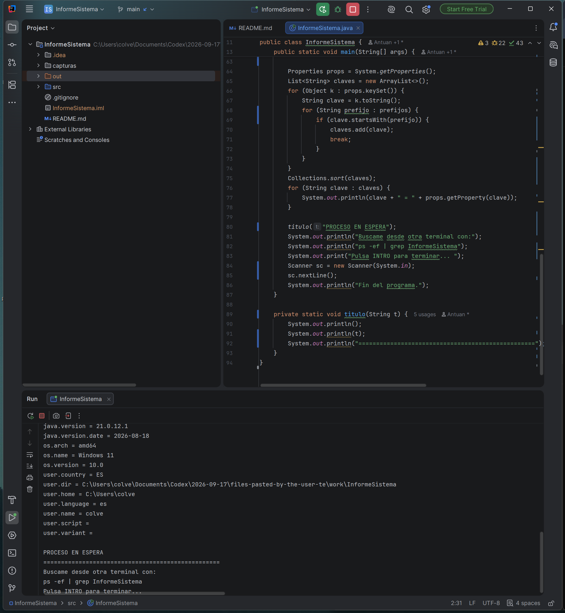
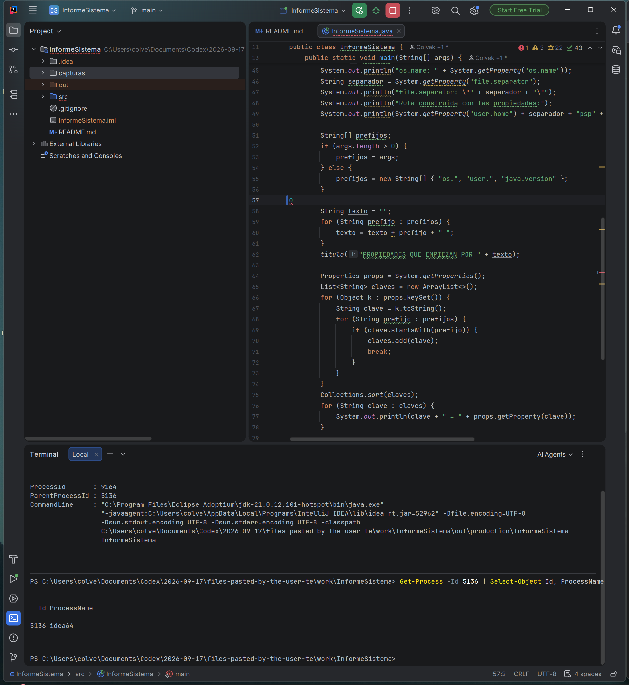
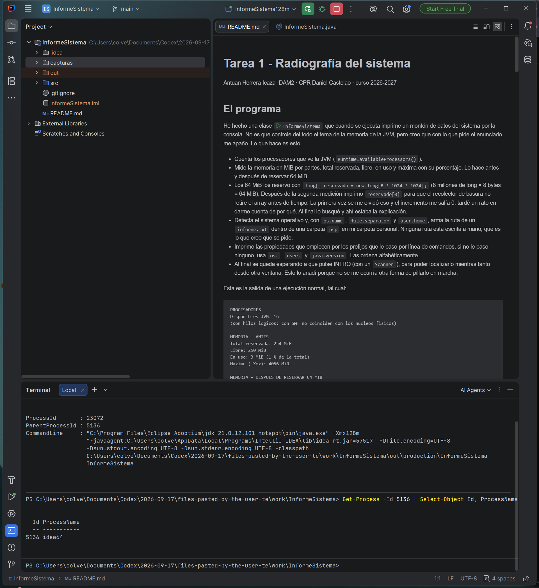
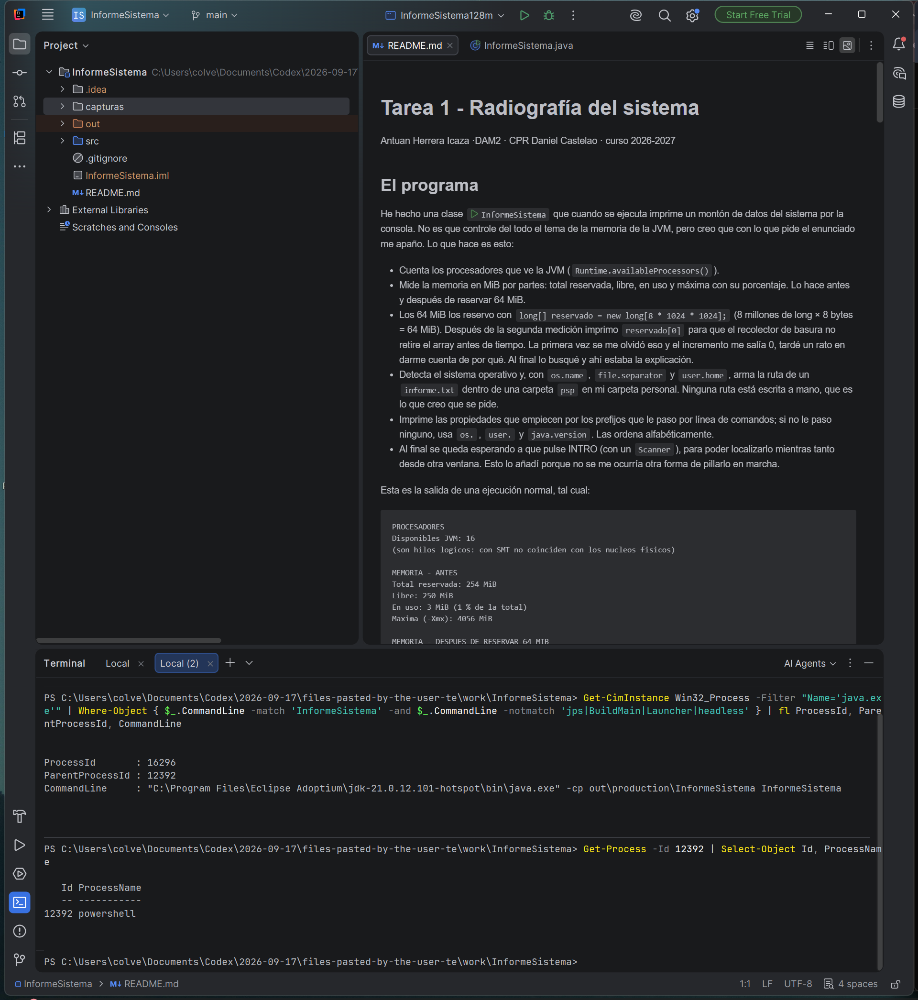

# Tarea 1 - Radiografía del sistema

Antuan Herrera Icaza ·DAM2 · CPR Daniel Castelao · curso 2026-2027

## El programa

He hecho una clase `InformeSistema` que cuando se ejecuta imprime un montón de datos del sistema por la consola. No es que controle del todo el tema de la memoria de la JVM, pero creo que con lo que pide el enunciado me apaño. Lo que hace es esto:

- Cuenta los procesadores que ve la JVM (`Runtime.availableProcessors()`).
- Mide la memoria en MiB por partes: total reservada, libre, en uso y máxima con su porcentaje. Lo hace antes y después de reservar 64 MiB.
- Los 64 MiB los reservo con `long[] reservado = new long[8 * 1024 * 1024];` (8 millones de long × 8 bytes = 64 MiB). Después de la segunda medición imprimo `reservado[0]` para que el recolector de basura no retire el array antes de tiempo. La primera vez se me olvidó eso y el incremento me salía 0, tardé un rato en darme cuenta de por qué. Al final lo busqué y ahí estaba la explicación.
- Detecta el sistema operativo y, con `os.name`, `file.separator` y `user.home`, arma la ruta de un `informe.txt` dentro de una carpeta `psp` en mi carpeta personal. Ninguna ruta está escrita a mano, que es lo que creo que se pide.
- Imprime las propiedades que empiecen por los prefijos que le paso por línea de comandos; si no le paso ninguno, usa `os.`, `user.` y `java.version`. Las ordena alfabéticamente.
- Al final se queda esperando a que pulse INTRO (con un `Scanner`), para poder localizarlo mientras tanto desde otra ventana. Esto lo añadí porque no se me ocurría otra forma de pillarlo en marcha.

Esta es la salida de una ejecución normal, tal cual:

```
PROCESADORES
Disponibles JVM: 16
(son hilos logicos: con SMT no coinciden con los nucleos fisicos)

MEMORIA - ANTES
Total reservada: 254 MiB
Libre: 250 MiB
En uso: 3 MiB (1 % de la total)
Maxima (-Xmx): 4056 MiB

MEMORIA - DESPUES DE RESERVAR 64 MIB
Total reservada: 254 MiB
Libre: 184 MiB
En uso: 69 MiB (27 % de la total)
Maxima (-Xmx): 4056 MiB
Incremento en uso: 66 MiB
(el array sigue en memoria: reservado[0] = 0)

SISTEMA
os.name: Windows 11
file.separator: "\"
Ruta construida con las propiedades:
C:\Users\colve\psp\informe.txt

PROPIEDADES QUE EMPIEZAN POR os. user. java.version
java.version = 21.0.12.1
java.version.date = 2026-08-18
os.arch = amd64
os.name = Windows 11
os.version = 10.0
user.country = ES
user.dir = C:\Users\colve
user.home = C:\Users\colve
user.language = es
user.name = colve
user.script =
user.variant =

PROCESO EN ESPERA
Buscame desde otra terminal con:
ps -ef | grep InformeSistema
Pulsa INTRO para terminar...
Fin del programa.
```

## Las dos ejecuciones

Primero lo ejecuté normal, desde IntelliJ con la configuración que viene por defecto:



Después con la memoria limitada. Me hice una configuración de ejecución llamada `InformeSistema128m` con la opción de VM `-Xmx128m` y la lancé igual que la otra:


Las dos se quedan esperando en "Pulsa INTRO para terminar...", que es lo que se ve al final de las capturas.

## El proceso, desde fuera

En Windows no hay `ps` ni `grep`, así que lo busqué con PowerShell:

```
Get-CimInstance Win32_Process -Filter "Name='java.exe'" | Where-Object { $_.CommandLine -match 'InformeSistema' -and $_.CommandLine -notmatch 'jps|BuildMain|Launcher|headless' }
```

Filtro por `InformeSistema` en la línea de comandos y descarto los procesos (`BuildMain` sale siempre al darle a Run y no es mi programa). Luego miro el PID padre con `Get-Process -Id <pid>`.

Con el programa en espera, esto es lo que sale:



El proceso era el PID 9164 y el padre el 5136, `idea64`. En la terminal integrada que se ve al fondo escribo las consultas mientras el programa espera. En la línea de comandos no hay ningún `-Xmx`, así que la JVM pone su máximo por defecto (4056 MiB).

Con la configuración `-Xmx128m`, también desde el IDE:



El PID era 23072 (cambia en cada ejecución) y el padre otra vez el 5136. Aquí sí se ve el `-Xmx128m` en la línea de comandos. Me lié la primera vez: no veía el `-Xmx128m` por ningún lado y resultó que se lo había puesto a otra configuración del IDE.

Y lanzándolo desde terminal (sin darle a Run):



Dejo el programa esperando en la primera pestaña y abro una segunda (`Local (2)`) para buscarlo. El PID era 16296 y el padre el 12392, `powershell`, la pestaña donde escribí el comando.

El PPID cambia según desde dónde se lance: `idea64` si lo lanzo desde el IDE y la terminal si escribo el comando a mano.

## Los números de la memoria

Comparando las dos ejecuciones:

| | Normal | Con -Xmx128m |
|---|---|---|
| Total reservada (antes → después) | 254 → 254 MiB | 128 → 128 MiB |
| Libre (antes → después) | 250 → 184 MiB | 125 → 61 MiB |
| En uso (antes → después) | 3 MiB (1 %) → 69 MiB (27 %) | 2 MiB (2 %) → 66 MiB (52 %) |
| Máxima (-Xmx) | 4056 MiB | 128 MiB |
| Incremento en uso | 66 MiB | 63 MiB |

La diferencia está en la **máxima**: con la opción limito la JVM a 128 MiB y sin ella pone 4056 MiB. La **total** baja por ese tope, y el mismo array de 64 MiB pesa mucho más sobre un heap pequeño (52 % frente a 27 %). El **incremento** sale casi igual (66 y 63 MiB) porque siempre reservo lo mismo.

## La ruta multiplataforma

En mi equipo el programa saca esta ruta:

```
C:\Users\colve\psp\informe.txt
```

En Linux sacaría esta:

```
/home/colve/psp/informe.txt
```

No la he podido probar en Linux, pero en el código no hay ninguna ruta escrita a mano: se monta con `user.home` y `file.separator`, así que la misma clase genera la ruta que toca en cada sistema.

## Apartado 3

**a) Un servidor web que atiende 500 peticiones a la vez en una máquina de 8 núcleos.**

Programación **concurrente** (algo de paralela si quedan núcleos libres). Son 500 peticiones para 8 núcleos, así que se van intercalando; cada una pasa casi todo el tiempo esperando a la red o a la base de datos. El problema: los hilos comparten datos y hay que sincronizarlos, de ahí salen las condiciones de carrera.

**b) Renderizar una película de animación en un plazo de tres meses.**

Programación **paralela** (y **distribuida** si se usan varias máquinas, como hacen las productoras con granjas de servidores). Un render se trocea en frames y cada núcleo calcula uno a la vez. El problema: siempre queda una parte que no se puede repartir (organizar tareas, juntar el resultado) y eso limita la mejora.

**c) Una app de móvil que descarga un fichero mientras sigues navegando.**

Programación **concurrente**. La descarga va en un hilo de fondo mientras la interfaz sigue respondiendo; sus instrucciones se intercalan. El objetivo no es acabar antes, sino que la app no se bloquee. El problema: coordinar los dos hilos al compartir datos (fichero, progreso) y que el hilo de fondo gasta más batería.

**d) Un cálculo que no cabe en la RAM de un solo equipo.**

Programación **distribuida**. Si los datos no caben en la memoria de una máquina, no sirve repartir hilos entre sus núcleos: te quedas sin RAM igual. Se reparten entre varias máquinas conectadas por red que se comunican por mensajes. El problema: la red es mucho más lenta que la memoria local, así que hay que dividir bien el problema y asumir que algún nodo puede fallar. Lo del nodo lo he leído por ahí, no lo he probado.

## Estructura

```
README.md
src/InformeSistema.java
capturas/
```
